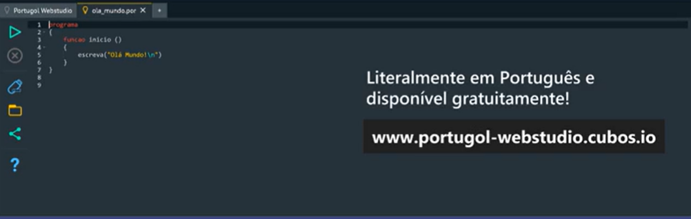
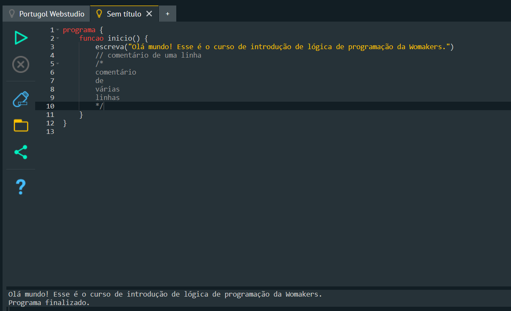
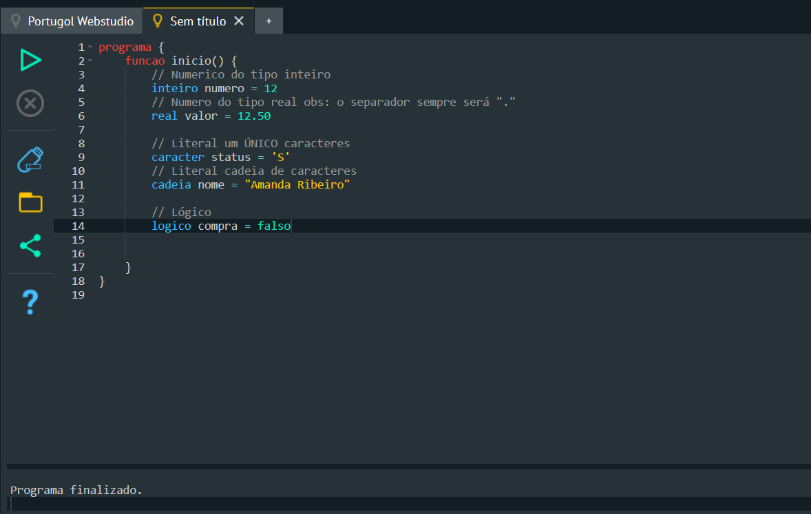
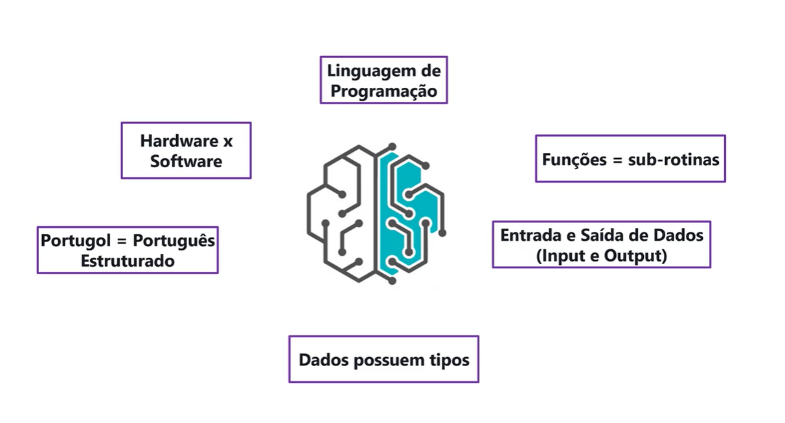

# Módulo 2: Introdução ao Portugol

## Aula 01: Conhecendo o Portugol Web Studio



## Aula 02: Estrutura básica de um programa e utilização de comentários



## Aula 03: Declarações de Variáveis e Tipos de Dados



## Aula 04: Declarações: Constante

## Aula 05: Trabalhando com Funções

Funções são sub-rotinas

Entrada e saída de dados:

```portugol
Escreva()
Leia()
Limpa()
```

## Aula 06: Entrada e Saída de Dados

## Aula 07: Função Escreva


```portugol
Escreva()
```

## Aula 08: Função Leia

Obter dados que serão inseridos pelo usuário

```portugol
Leia()
```

## Aula 09: Função Limpa

Limpa a tela de tudo que ficou pra trás do código `limpa()`

```portugol
Limpa()
```

## Aula 10: Criando uma função

````portugol
programa {
	funcao inicio() {

	    cadeia nome
	    inteiro idade

	    escreva("Qual a sua idade? \n")
	    leia(idade)

	    escreva("\nQual o seu nome? \n")
	    leia(nome)

	    escreva("O nome da cliente é ", nome, "ela tem ", idade, " anos de idade")

	}

	funcao cadeia nomeCliente(cadeia nome){
	    retorne nome + "da Silva"
	}

	funcao inteiro idadeCliente(inteiro idade){
	    retorne idade
	}
}
````

## Aula 11: Revisão do módulo



## Exercícios para fixação de conteúdo


````portugol
programa {
  funcao inicio() {

    cadeia nome, sobrenome

    escreva("\n Digite seu primeiro nome: \n")
    leia(nome)

    escreva("\nDigite seu último sobrenome: \n")
    leia(sobrenome)

    escreva(sobrenome, ", ", nome)
  }

  funcao cadeia nome(cadeia nome){
    retorne nome
  }

  funcao cadeia sobrenome(cadeia sobrenome){
    retorne sobrenome
  }
}
````

## 🔗 Links && Referências

[Portugol webstudio](https://portugol-webstudio.dgadelha.xyz/)
