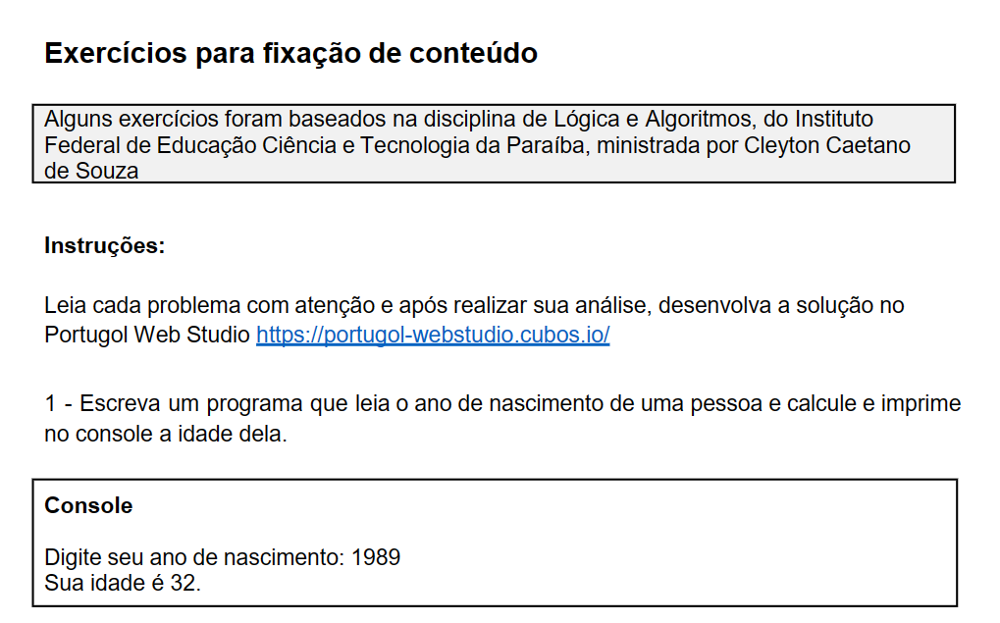
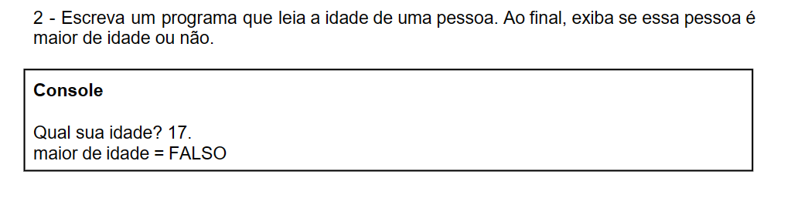
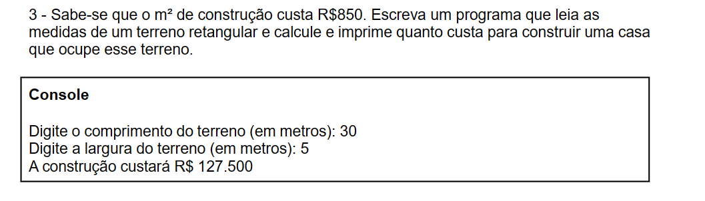
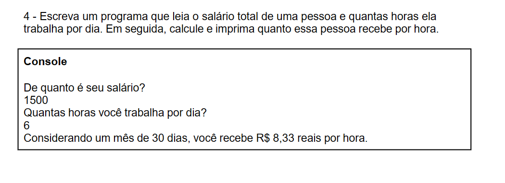
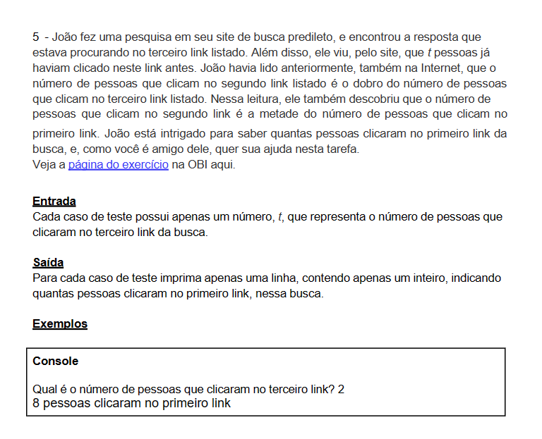

# Módulo 3: Expressões

## Aula 01: Introdução ao Módulo e Operações

## Aula 02: Soma - Operadores Simples

## Aula 03: Subtração - Operadores Simples

## Aula 05: Conceito de Expressões Matemáticas

## Exercícios para fixação de conteúdo



````portugol
programa {
  funcao inicio() {
    inteiro anoNascimento, idade

    escreva("Digite seu ano de nascimento: ")
    leia(anoNascimento)

    idade = 2023 - anoNascimento
    escreva("Sua idade é ", idade, ".")
  }
}
````



````portugol
programa {
  funcao inicio() {
    inteiro idade
    const inteiro MAIORIDADE = 18

    escreva("Qual sua idade? ")
    leia(idade)


    se (idade >= MAIORIDADE)
    {
      escreva("maior de idade = VERDADEIRO")
    }
    senao
    {
        escreva("maior de idade = FALSO")
    }
  }
}
````



````portugol
programa {
  funcao inicio() {
    real comprimento, largura, calculo
    const real METROQUADRADO = 850

    escreva("Digite o comprimento do terreno(em metros): ")
    leia(comprimento)


    escreva("\nDigite a largura do terreno(em metros): ")
    leia(largura)


    calculo = (comprimento * largura) * METROQUADRADO

    escreva("\nA construção custará R$ ", calculo)
  }
}
````



````portugol
programa {
  funcao inicio() {
    real salario, calculo
    inteiro horas


    escreva("De quanto é seu salário?\n")
    leia(salario)

    escreva("Quantas horas você trabalha por dia?\n")
    leia(horas)

    calculo = (salario / 30) / horas

    escreva("Considerando um mês de 30 dias,você recebe R$", calculo, " reais por hora")

  }
}
````



````portugol
programa {
  funcao inicio() {
    inteiro t, primeiroLink, segundoLink


    escreva("Qual é o número de pessoas que clicaram no terceiro link? ")
    leia(t)


    segundoLink = t * 2
    primeiroLink = segundoLink * 2

    escreva(primeiroLink, " pessoas clicaram no primeiro link")
  }
}
````
