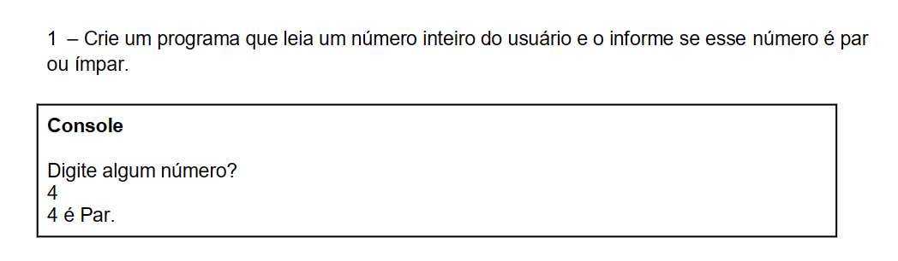
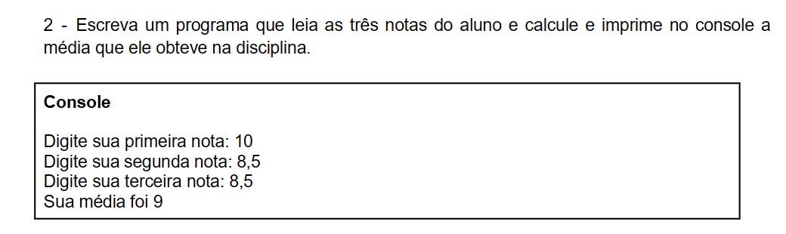
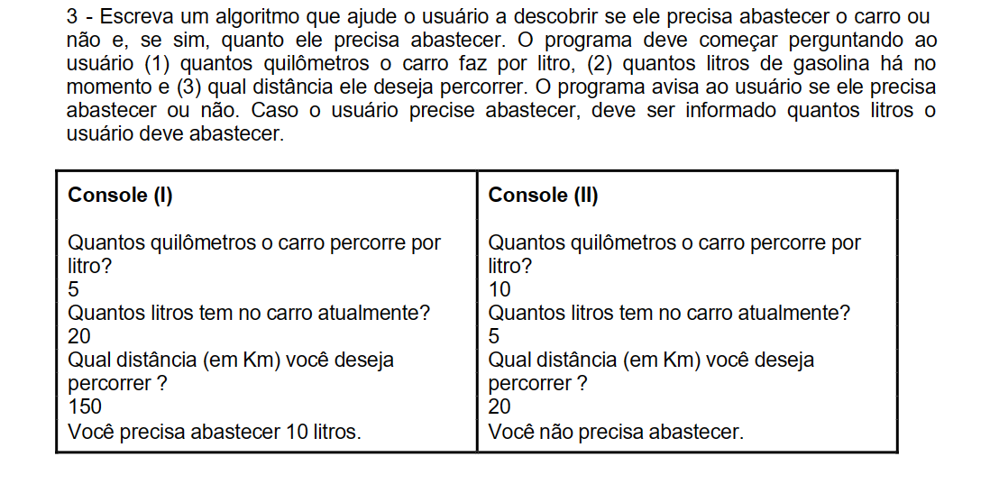

# Módulo 4 Algoritmos Sequenciais e Estruturas de Controle


## Aula 01: Operadores Relacionais

````portugol

````

## Aula 02: Programa de Score - Operadores Relacionais

````portugol

````

## Aula 03: Introdução a Algoritmo Sequencial

````portugol

````

## Aula 04: Exercício: Maioridade Penal

````portugol

````

## Aula 05: Estrutura de Controle

````portugol

````

## Aula 06: Exercício: Calcular Média

````portugol
programa {
    funcao inicio() {
        real nota1, nota2, media

        escreva("Digite a primeira nota: \n")
        leia(nota1)
        escreva("Digite a segunda nota: \n")
        leia(nota2)

        media = (nota1 + nota2) / 2

        escreva("A média da sua nota é: ", media)
    }
}

````

## Exercícios para fixação de conteúdo





## 🔗 Links && Referências

[Portugol webstudio](https://portugol-webstudio.dgadelha.xyz/)