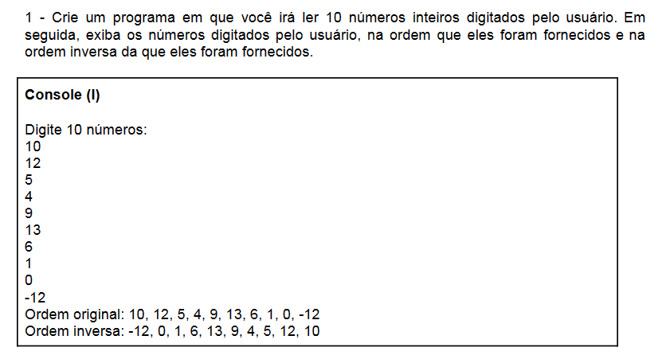
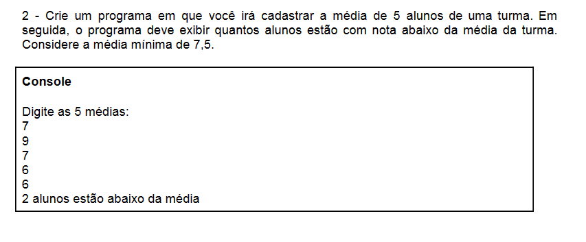

# Módulo 6: Vetores e Matrizes

## Aula 01: Fundamentos Estrutura de Dados II

## Aula 02: Conhecendo Arrays e Vetores

Estrutura de dados é o ramo da computação que estuda os diversos mecanismos de organização de dados para entender aos diferentes requeisitos de processamento. As estruturas de dados definem a organização, métodos de acesso e opções de processamento para a informação manipulada pelo programa.

*Homogêneas: Arrays, Vetores e Matrizes*
Grupo de dados, do mesmo tipo, armazenados em uma única variável, na memoria do computador.

*Estrutura de dados - Heterogêneas*
Conjunto de dados formados por tipos de dados distintos, em uma mesma estrutura. Ex: inteiro, real e caracteres.

*Estrutura de dados - Populares*
- Arrays
- Lista
- Fila
- Pilha
- Árvore

**Arrays** - Estrutura de dados homogêneas, ou seja, armazenam apenas dados do mesmo tipo. São lineares e estáticas, isto é, possuem um número fixo de elementos de um determinado tipo de dado.
Este dados são acessados individualmente por meio de um índice, onde geralmente a posição inicial é zero. Os arrays são dividos em dois tipos: *Vetor (unidimensional) e Matriz (multidimensional)*

## Aula 03: Criando algoritmo com índice vetorial

````portugol
programa {
	funcao inicio() {
        cadeia nome[] = {"Ada Lovelace", "Grace Hopper", "Mary Kenneth", "Carol Shaw    ", "Frances Allen"}
        inteiro nascimento[] = {1815, 1906, 1913, 1955, 1932}

        escreva("Mulheres que marcaram a computação: \n\n")

        para (inteiro posicao = 0; posicao < 5; posicao++){
            escreva(nome[posicao], "\t\t", nascimento[posicao], "\n")
        }
	}
}
````

## Aula 04: Conhecendo Matrizes

**Matrizes** - Indices: índices de dados do mesmo tipo (real). Similar a uma planilha, possui dois índices um na Horizontal e um na vertical e identificador ou seja nome único da matriz.

## Aula 05: Criando um Algoritmo Linhas e Colunas

````portugol
programa {
	funcao inicio() {
        inteiro notas [4][4] = {{1,2,3,4},
        {1,2,3,4},
        {1,2,3,4},
        {1,2,3,4}}

        para(inteiro l = 0; l < 4; l++){
            para(inteiro c = 0; c < 4; c++){
                escreva(notas[l][c], ",")
            }
            escreva("\n")
        }
	}
}
````

## Aula 06: Estrutura Heterogênea - Registros

Um registo é uma estrutura que fornece um formato especializado para armazenar informações em memória. Registros são diferente dos Arrays.
O recurso de registro nos permite armazenar mais de um tipo de dado.Ex: CPF, texto, data, decimal...

O Registro é composto por campos que especificam cada uma das informações que o compõem.

````bash
// declaração do tipo de dado
tipo
    estrutura_livro = registro
        nome = caracter
        preco = real
        pagina = inteiro
    fimregistro

// declaração das variáveis
    i inteiro
    livro array[1..3] de estrutura_livro

    escreva("Entre com os nomes, preços e número de páginas de três livros")
    para i de 1 ate 3 faca
        leia(livro[i].nome, livro[i].preco, livro[i].paginas)
        fimpara
        escreva("Esses foram os dados digitados")
        para i de 1 ate 3 faca
            escreva(livro[i].nome, livro[i].preco, livro[i].paginas)
        fimpara
fimalgoritmo
````

## Exercícios para fixação de conteúdo

### Exercício 1



### Exercício 2



## 🔗 Links && Referências

[Portugol webstudio](https://portugol-webstudio.dgadelha.xyz/)